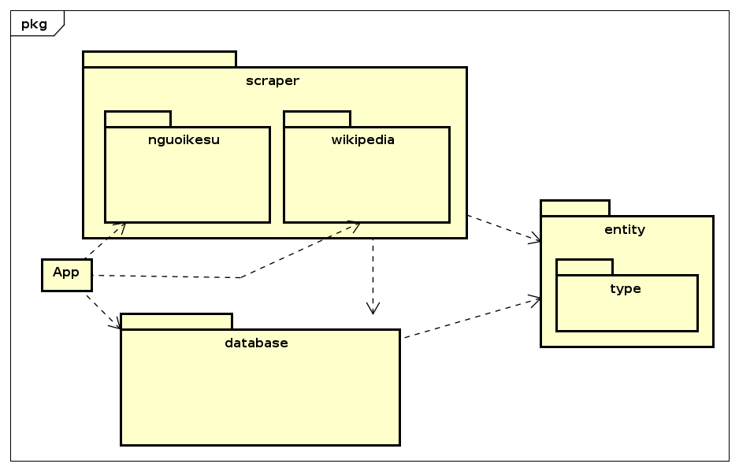
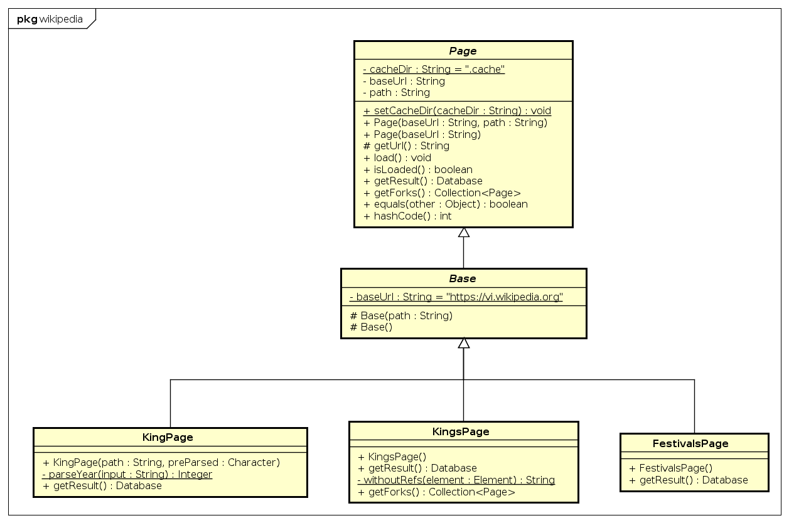
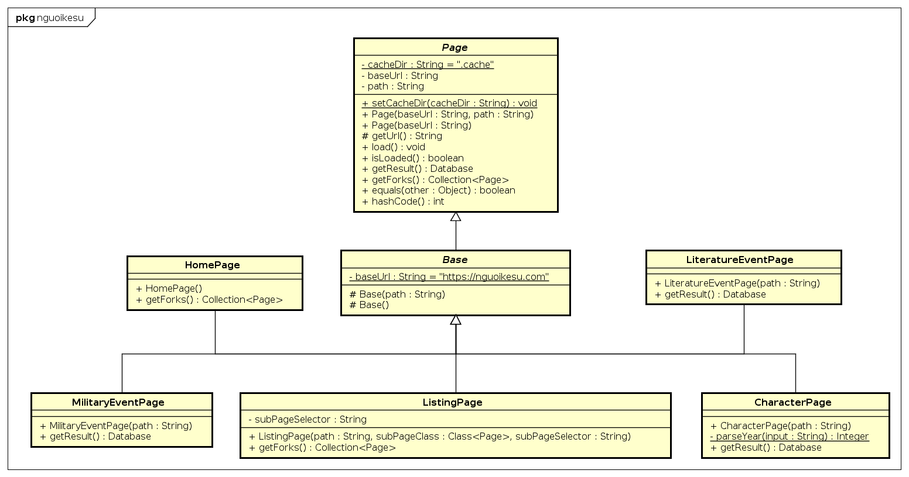
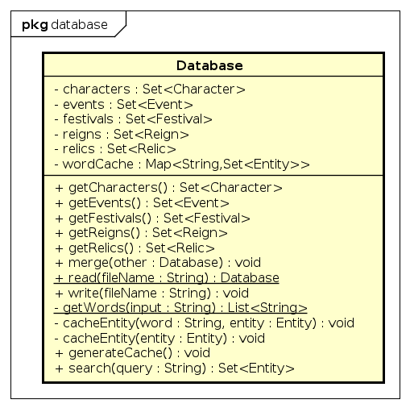
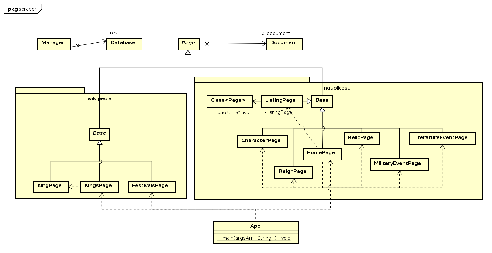
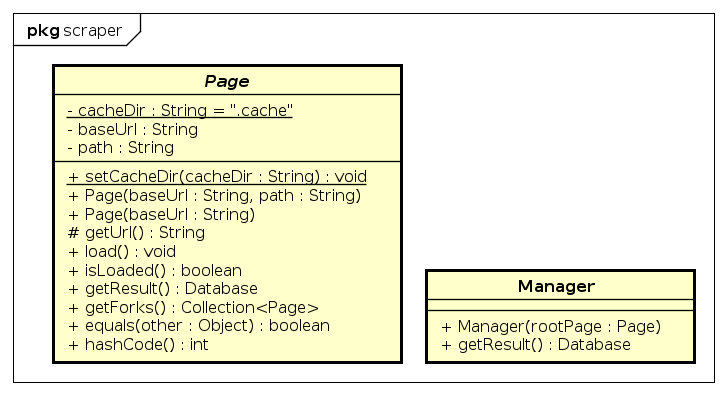

# I. Collected Data Overview

## 1. Quantity

| Entity    | Quantity |
|-----------|:--------:|
| Character |   1617   |
| Event     |    77    |
| Festival  |    89    |
| Reign     |    22    |

## 2. Data Property

- `Database`: Stores infomation of everything
- 2 new types: `Date` and `YearRange`
  - `Date`: Attributes: `day`, `month` and boolean to determine if it's lunar date
  - `YearRange`: Attributes: `begin` and `end`, for a period of time during which something happens  
- `'Entity`: abstract class, base for all entites. Attributes: `name` and `source`
  - `Character`: `father`, `life`, `crowned`
  - `Festival`:
## 3. Data Association

# II. UML Diagrams

## 1. Package dependency diagram

## 2. Class dependency diagram
### Wikipedia scraper

### nguoikesu scraper

# III. Design Analysis

# IV. Object-Oriented Programming Techniques

## 1. Abstraction

## 2. Encapsulation

## 3. Inheritance

## 4. Polymorphism
**Polymorphism** plays a crucial role in enhancing code *flexibility* and *reusability*. In our project, we used **polymorphism** to enable the `Manager` class to treat every `Page` object without concerning itself with the specific details of each `Page`'s functionality.

By treating every `Page` object uniformly, the `Manager` class was able to interact with them using a common set of methods, independent of the specific details of each `Page`'s functionality. 

This *decoupling* of the `Manager` from individual `Page` implementations resulted in a more maintainable and extensible codebase, enabling seamless additions of new `Page` types in without modifying the Manager class.

## 6. Overloading and Overriding: 
Classes can have optional parameter. For example, `Date` has the attribute `moon` that tell if it's lunar date or not. Using overloaded constructor, we can create `Date` objects with different sets of input parameters for flexibility.

# V. Technologies Utilized

- **Maven**: Build automation and dependency management tool.
- **Jsoup**: Java library for parsing HTML and extracting data from web pages.
- **Gson**: Java library to convert Java Objects into JSON representation and vice versa.
- **Astah** UML: UML modeling tool for dependency diagrams.
- **JavaFX Scene Builder**: Visual layout tool for designing UI.
- **Git VCS**: Version control system to track changes in source code during software development.

- **GitHub**: Web-based platform for hosting and collaborating on Git repository.
